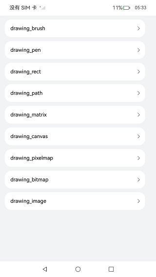
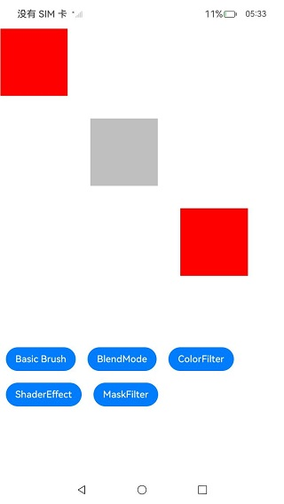
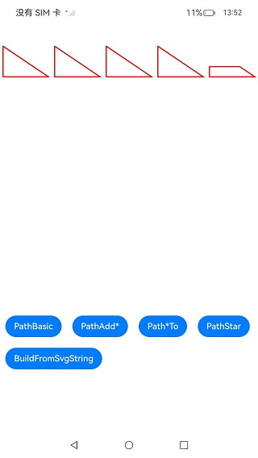
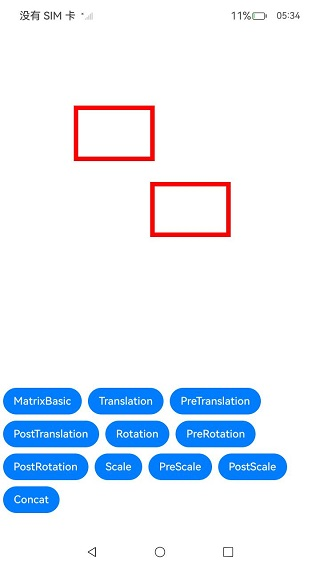
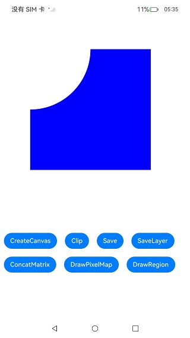
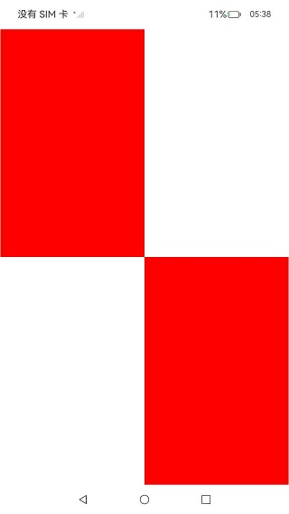

# Drawing API示例(C/C++)

#### 介绍

Drawing模块提供包括2D图形渲染、文字绘制和图片显示等功能函数。这是一个基于Drawing图形库API(C/C++)的示例项目，展示如何使用Drawing API进行基础的2D图形绘制操作，详见[drawing](https://docs.openharmony.cn/pages/v5.0/zh-cn/application-dev/graphics/graphic-drawing-overview.md)。

#### 效果预览












#### 具体实现

使用Drawing进行图形绘制与显示时，需要使用Native Drawing模块的画布画笔绘制一个基本的2D图形；并将图形内容写入NativeWindow提供的图形Buffer，将Buffer提交到图形队列；再利用XComponent将C++代码层与ArkTS层对接，实现在ArkTS层调用绘制和显示的逻辑，并在应用上显示图形。

### 使用说明

1. 在主界面，可以点击对应按钮，选择需要参考的API示例(主界面的一个按钮对应一个API头文件)。

2. 进入示例界面，查看参考示例（如果有按钮，需要点击按钮才能查看对应的场景示例）。

#### 工程目录

```
├──entry/src/main
│  ├──cpp                           // C++代码区
│  │  ├──CMakeLists.txt             // CMake配置文件
│  │  ├──napi_init.cpp              // Napi模块注册
│  │  ├──common                     // 日志封装定义文件
│  │  │  └──log_common.h
│  │  ├──plugin                     // 生命周期管理模块
│  │  │  ├──plugin_manager.cpp
│  │  │  └──plugin_manager.h
│  │  ├──samples                    // samples渲染及示例模块
│  │  │  ├──sample_brush.cpp        // drawing_brush.h对应的cpp示例
│  │  │  ├──sample_canvas.cpp       // drawing_canvas.h对应的cpp示例
│  │  │  ├──sample_graphics.cpp     // samples渲染的cpp文件
│  │  │  ├──sample_matrix.cpp       // drawing_matrix.h对应的cpp示例
│  │  │  ├──sample_path.cpp         // drawing_path.h对应的cpp示例
│  │  │  ├──sample_pen.cpp          // drawing_pen.h对应的cpp示例
│  │  │  ├──sample_pixelmap.cpp     // drawing_pixelmap.h等文件对应的cpp示例
│  │  │  ├──sample_rect.cpp         // drawing_rect.h对应的cpp示例
│  │  │  └──sample_graphics.h       // samples渲染的头文件
│  │  ├──types                      // 不涉及
│  │  ├──utils                      // 多设备适配工具类
│  │  │  ├──adaptation_utils.cpp
│  │  │  └──adaptation_utils.h
│  ├──ets                           // ets代码区
│  │  ├──drawing
│  │  │  ├──pages
│  │  │  │  ├──BitmapDrawing.ets    // drawing_bitmap.h对应的示例展示界面
│  │  │  │  ├──BrushDrawing.ets     // drawing_brush.h对应的示例展示界面
│  │  │  │  ├──CanvasDrawing.ets    // drawing_canvas.h对应的示例展示界面
│  │  │  │  ├──ImageDrawing.ets     // drawing_image.h对应的示例展示界面
│  │  │  │  ├──MatrixDrawing.ets    // drawing_matrix.h对应的示例展示界面
│  │  │  │  ├──PathDrawing.ets      // drawing_path.h对应的示例展示界面
│  │  │  │  ├──PenDrawing.ets       // drawing_pen.h对应的示例展示界面
│  │  │  │  ├──PixelMapDrawing.ets  // drawing_pixel_map.h对应的示例展示界面
│  │  │  │  └──RectDrawing.ets      // drawing_rect.h对应的示例展示界面
│  │  ├──entryability               // 不涉及
│  │  ├──entrybackupability         // 不涉及
|  |  ├──interface
│  │  │  └──XComponentContext.ts    // XComponentContext
│  │  └──pages                      // 页面文件
│  │     └──Index.ets               // 主界面
|  ├──resources                     // 资源文件目录（不涉及）
```

#### 相关权限

暂无

#### 依赖

暂无

## 约束和限制

1. 本示例支持标准系统上运行，支持设备：RK3568;

2. 本示例支持API14版本SDK，版本号：5.0.3.58；
   
3. 本示例已支持使DevEco Studio 5.0.11 Release (构建版本：5.0.11.100，构建 2025年4月22日)编译运行

## 下载

如需单独下载本工程，执行如下命令：

```
git init
git config core.sparsecheckout true
echo code/DocsSample/Drawing/NDKAPIDrawing/ > .git/info/sparse-checkout
git remote add origin https://gitee.com/openharmony/applications_app_samples.git
git pull origin master
```